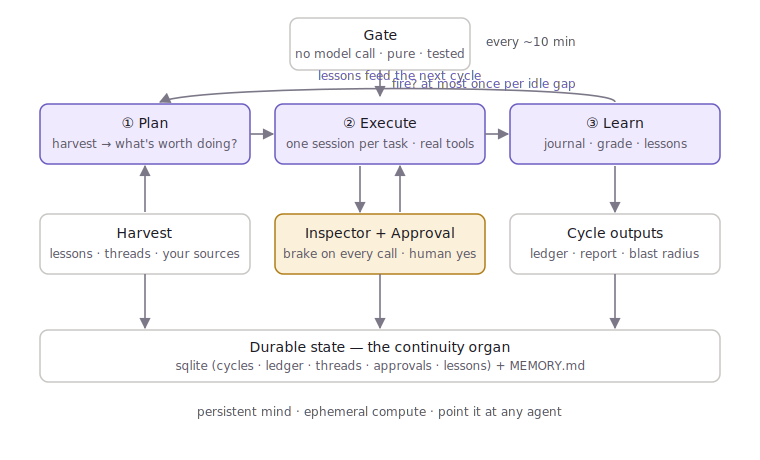

<h1 align="center">reverie-automata</h1>

<p align="center">
  <em>What does your agent do when nobody's watching?</em>
</p>

<p align="center">
  
  
  
  
  
  
  
</p>

<p align="center">
  
</p>

---

You hire an agent so it's useful while you're there. Then you go to bed, and it just sits at the prompt, waiting to be spoken to. So you reach for cron: a table of jobs on a timer. Now it runs `backup.sh` at 3am whether or not anything changed, and it still can't see the bug you left open in the editor.

reverie-automata gives those quiet hours to the agent instead. It reads the room, decides what's actually worth doing (a lazy night is a valid answer), does it with real tools, checks its own work against evidence, and writes down what it learned so the next run is sharper. Then it gets out of the way.

A loop with taste. Point it at any coding agent you already run.

## Before / after

**cron:** a to-do list on a timer. It fires `reindex.py` every night. It has no idea the index is already fresh, and no idea you spent yesterday fighting a flaky test.

**reverie-automata:** the same idle slot, but the agent looks first. Index is fresh, nothing queued, no new input since it last ran? It records "nothing worth doing" and sleeps. Sees the flaky test you left? It reproduces it, fixes it, leaves a one-line note, and files anything risky for your approval before touching it.

The difference isn't the schedule. It's that one of them *thinks* before it acts.

## How it works

A model-free gate decides whether to spend anything at all. If it fires, the agent walks three phases:

```
GATE   in the window? idle long enough? armed? under budget?     (pure function, no model call)
  │
  ▼
① PLAN     harvest context → what did I learn last cycle? → what's worth doing now?
② EXECUTE  one session per task, real tools, "done" only against evidence.
           risky? → parked for your approval, keep working on the safe stuff.
③ LEARN    journal · grade derived from the ledger · falsifiable lessons → next cycle
```

Three details carry the whole design:

- **The gate is a pure function.** Whether to act, window, idle threshold, budget floor, daily and gap caps, and the load-bearing *fire-once-per-idle-gap*, is decided with no model call and no I/O, and tested without a clock or a network. Four idle hours is one cycle, not four.
- **The agent earns "done."** A persistent agent's worst failure is fabrication: one invented fact in memory is recalled forever as true. So `done` is only recorded against a rerun, a diff, or a fetched response, never vibes, and lessons are falsifiable by construction (a situation, an action, the outcome actually observed).
- **Risk is caught on the action, not the plan.** A tool-layer inspector classifies each concrete call: protected-path writes, privileged commands, raw egress, mass deletion, messaging strangers. Those become approvals bound to the exact diff or command, delivered to a human whose identity is verified before their yes counts. Everything else runs and is logged, with a per-cycle blast radius of anything touched outside the sandbox.

## Point it at your agent

Every modern coding agent has a "run this prompt, print the result" mode. That's the whole contract. Pick one in config, no code:

```yaml
agent:
  backend: claude_code      # claude_code · codex · cursor · devin · windsurf · cline · pi · mock
  options: { bin: claude, model: sonnet }
```

| backend | driven by |
|---|---|
| `claude_code` | `claude -p <prompt> --output-format json` |
| `codex` | `codex exec <prompt> --full-auto` |
| `cursor` | `cursor-agent -p <prompt>` |
| `devin` | your `devin run <prompt>` wrapper |
| `windsurf` | `windsurf --headless -p <prompt>` |
| `cline` | `cline task <prompt>` |
| `pi` | configurable `bin` + subcommand |
| `mock` | deterministic, offline, for the demo and tests |

Binaries and flags come from config, because CLIs move fast. A new backend is a ~15-line subclass, never a fork. Same for approval **transports** (`stdout`, `telegram`, your own Slack or webhook) and context **sources** (files, shell probes, marker-scanned repos, your own inbox).

## Quickstart

No key required. The demo runs on the deterministic mock backend.

```bash
git clone https://github.com/freeze1999/reverie-automata && cd reverie-automata
python examples/demo.py       # one full plan → execute → learn cycle
python -m pytest -q            # 16 tests, standard-library core (pytest + pyyaml for the suite)
```

Point it at a real agent and a real project:

```bash
cp reverie.yaml.example reverie.yaml               # edit the one file
python examples/with_claude_code.py ~/my-project   # one supervised cycle, watched
```

Run it as an actual idle loop (cron, every 10 minutes):

```python
from reverie_automata import Config, Runner

runner = Runner(
    Config.load("reverie.yaml"),
    last_input_ts=lambda: my_last_user_activity(),   # when did a human last act?
    is_available=lambda: not currently_busy(),        # yield while they're around
)
runner.tick()      # the gate decides; the engine only runs when it should
```

## What one cycle leaves behind

- a ledger row for every task, written *as it happens*, so a crash mid-cycle still tells the truth;
- a journal entry in the agent's own words, plus a grade **derived from the ledger**, never self-awarded;
- zero to three falsifiable lessons in `MEMORY.md`, the policy the next cycle opens by reading;
- open **threads**, the single work queue, carrying unfinished or parked work forward;
- an `outcome.json` per cycle with the full trace and blast radius.

Continuity lives in that durable state, not in a session that never ends. Persistent mind, ephemeral compute: the agent wakes, reconstructs what matters from memory, acts, consolidates, sleeps.

## Layout

| module | does |
|---|---|
| `gate.py` | the model-free "fire this tick?" decision, plus a PID-aware lock. pure, tested. |
| `harvest.py` | assembles the working context under a hard token budget. |
| `engine.py` | plan → execute → learn. owns every durable write. |
| `inspector.py` | the tool-layer brake. classifies each concrete call. pure, tested. |
| `store.py` | sqlite: cycles, ledger, threads, artifact-bound approvals, lessons. |
| `prompts.py` | the three phase prompts. generic defaults, override freely. |
| `adapters/` | agent backends · approval transports · context sources. |
| `runner.py` | gate and persistence glue for a cron entrypoint. |

Design notes in [`docs/architecture.md`](docs/architecture.md). Writing a new adapter: [`docs/adapters.md`](docs/adapters.md).

## Status

A clean-room reference implementation, provider-agnostic, standard-library core (`pytest` and `pyyaml` for the suite, `tiktoken` optional for sharper budgeting). Not a batteries-included platform, the interesting parts are the interfaces. Wire them to whatever you already run.

## License

MIT. Take it, point it at something, let it think while you sleep.

<p align="center"><sub>a loop with taste</sub></p>
