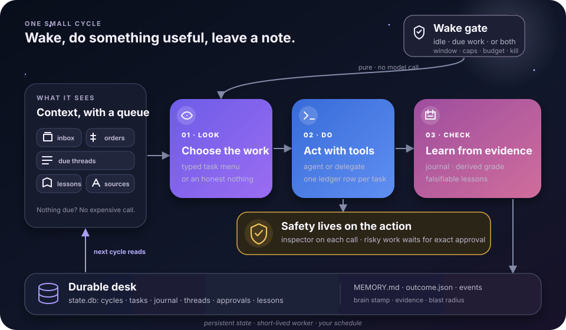

<h1 align="center">✦ reverie-automata ✦</h1>

<p align="center">
  <em>Let your coding agent do one useful thing while you sleep. ♡</em>
</p>

<p align="center">
  
  
  
  
  
  
  
</p>

<p align="center">
  
</p>

Your coding agent usually waits for you to type something.

reverie-automata gives it a small bedtime routine. It wakes when your rules allow it. Then it looks at the project, picks one task, checks its work, and leaves you a note.

If there is nothing useful to do (trust it, it will judge if things are worth doing), it produces nothing. If a task looks risky, it waits for you. Like your lazy intern.

## how it works

```text
wait → look → plan → do → check → remember → sleep
```

Each cycle has three parts:

1. **Plan:** Read the project and choose useful work.
2. **Execute:** Use your coding agent to do the task.
3. **Learn:** Record what happened for the next cycle.

A small gate runs first. It checks the time, idle period, budget, and daily limit. This keeps one long night from becoming a pile of surprise runs.

## try the demo

You need Python 3.10 or newer. The demo is local and does not need an API key.

```bash
git clone https://github.com/freeze1999/reverie-automata
cd reverie-automata
python3 examples/demo.py
```

The demo runs one complete cycle with a pretend agent. You can watch each step and read its notes.

## try a real agent

The Claude Code example runs one supervised cycle. Install and sign in to Claude Code first.

```bash
python3 examples/with_claude_code.py ~/my-project
```

Built-in adapters support Claude Code, Codex, Cursor, Devin, Windsurf, Cline, Pi, and local models. Copy `reverie.yaml.example` when you are ready to change the schedule or safety rules. See [the adapter guide](docs/adapters.md) for setup.

## what you get in the morning

- A list of every task and its result
- A short journal from the cycle
- Lessons for the next run
- A record of files changed outside the sandbox
- Approval requests for risky work

The agent may only mark a task as done when it has evidence. Evidence can be a test result, diff, or fetched response.

## safety

- The gate limits when and how often a cycle can run.
- The inspector checks real tool calls before they run.
- Protected file writes, deletion, privileged commands, and raw uploads can be blocked.
- Risky work can wait for approval while safe work continues.
- Each cycle writes a ledger as it works, so a crash still leaves a useful record.

Start with the demo. Read the output. Point it at a test project before you trust it with anything important.

## status

This is a reference project for developers. It is not a hosted service or a one-click app.

Think of it as a cute janitor. It cleans up or patches your stuff when you are idle. Idle time is only the default. Customize it, reverse engineer it, and tinker with it. The loop can live wherever it is useful.

The core uses the Python standard library. Tests need `pytest` and `pyyaml`.

For the full design, read [the architecture notes](docs/architecture.md). For agent setup, read [the adapter guide](docs/adapters.md).

## license

MIT. Give your agent a quiet little job, then ask for receipts in the morning. ♡

<p align="center"><sub>when the machine gets bored, it makes something · or nothing</sub></p>
